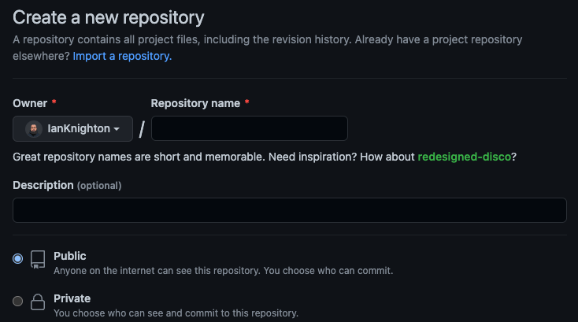

I went on this journey the other day and I found it to be a bit more difficult than it seemed on paper. I figured since I went out of my way to make it work I should probably see if I can make it easier for the next person that comes along. This probably isn't an exhaustive resource, but it's (*hopefully*) enough to help someone get up and running. 

## Create a GitHub Repository

At this point, I'm going to assume that you've seen this screen 100+ times.

The only thing that you'll need to do different here is make sure two things are true:
1. The repository is public.
2. The repository is named `GITHUB_USERNAME.github.io`

Once that is setup, you have all of the bones you need.

## Setup Jekyll
